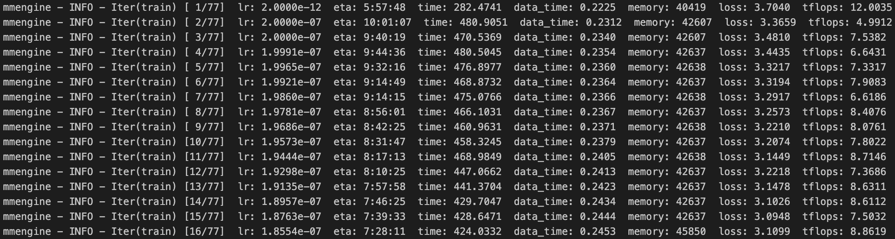

# DeepSeek-V3/R1-617B 全参数微调指南

<div align="center" style="line-height: 1;">

[](https://github.com/ScienceOne-AI/DeepSeek-671B-SFT-Guide)
[](https://opensource.org/licenses/Apache-2.0)

[中文版](./README_zh.md) ｜ [English](./README.md)

</div>

DeepSeek-V3/R1 满血版 671B 全参数微调的开源解决方案，包含从训练到推理的完整代码和脚本，以及实践中积累一些经验和结论，由中国科学院自动化研究所和中科闻歌联合推出。

## 🌟 项目亮点
- 实现了包含 DeepSeek-V3/R1 训练逻辑的 modeling 文件（详见 `./model`，根据 Deepseek-V3 论文并结合 Deepseek-V2 的 modeling 文件进行代码逻辑补全）；
- 实现了基于数据并行（DeepSpeed ZeRO）+ 序列并行（SP）的 DeepSeek-V3/R1 671B 满血版全参数微调；
- 总结了模型训练和部署全流程踩坑经验、遇到的问题及解决方案。


## 🚀 快速开始
### 1. 硬件配置

单台服务器配置如下表，集群中共 32 台相同配置的机器，共享 100TB 存储空间，挂载路径为 `/nfs`。机器操作系统为 Ubuntu 22.04，机器之间使用 IB 网络进行通信，GPU 之间通过 NVLink 通信，CUDA 版本为 12.6。


| 组件       | 规格/版本                   |  查看详细配置命令           |  
|------------|-----------------------|-----------------------| 
| GPU        | 8 x NVIDIA H100 80GB HBM3   | `nvidia-smi`    |   
| CPU        | Intel(R) Xeon(R) Platinum 8463B (96 Cores)    | `lscpu` |    
| 内存       | 2.0TB DDR4      |  `free -h` | 
| 存储       | 100TB NVMe SSD  | `df -h` | 
| 网络       | InfiniBand 400G | `ibstat` | 
| 操作系统    | Ubuntu 22.04    | `uname -a` | 
| CUDA      | CUDA 12.6       | `nvcc -V` | 


### 2. 环境配置

我们基于 xtuner 框架进行扩展和改进，使其支持 Deepseek V3/R1（即 `DeepseekV3ForCausalLM` 模型架构）的全参数微调，支持数据并行（DeepSpeed ZeRO based DP）和序列并行（Sequence Parallel, SP）。

安装 Python 环境，可根据项目中 `requirements.txt` 安装依赖包，并将 `./code/xtuner` 与 `DeepseekV3ForCausalLM` 训练相关的核心代码覆盖原始 xtuner package 的对应代码即可。

```bash
conda create -n ds_env python=3.10
conda activate ds_env
pip install -r requirements.txt

# 覆盖核心代码 这里修改为你的环境路径
YOUR_ENV_PATH='/nfs/miniconda3/envs/ds_env/lib/python3.10/site-packages'
cp -r ./code/xtuner $YOUR_ENV_PATH
```

### 3. 数据准备
我们基于 OpenAI 标准数据格式进行扩展以兼容 reasoning 数据，每条原始训练数据格式如下。如果有思考过程，则 assistant 角色的 `reasoning_content` 字段非空。
```json
{
  "messages": [
    {"role": "system", "content": "You are a helpful assistant."},
    {"role": "user", "content": "用户问题"},
    {"role": "assistant", "content": "最终回答", "reasoning_content": "思考过程"}
  ]
}
```

为了简化处理逻辑，我们将 `reasoning_content` 和 `content` 按照 Deepseek 的训练格式合并到 `content` 字段中。此外，为了兼容多轮对话的训练逻辑，还为 assistant 角色的每轮添加了 `loss` 字段，仅对值为 `true` 的 `content` 内容计算 loss。
```json
{
  "messages": [
    {"role": "system", "content": "You are a helpful assistant."},
    {"role": "user", "content": "用户问题"},
    {"role": "assistant", "content": "<think>\n思考过程\n</think>\n\n最终回答", "loss": true}
  ]
}
```

为了更清晰地展示数据存储格式，我们提供了一份转换后的数据样例文件 `./data/train_example.json` 以供参考。

在实际训练时，程序会根据 Deepseek V3/R1 的训练模版自动转换为如下格式，这里仅供展示：
```
<｜begin▁of▁sentence｜>You are a helpful assistant.<｜User｜>用户问题<｜Assistant｜><think>\n思考过程\n</think>\n\n最终回答<｜end▁of▁sentence｜>
```

### 4. 启动训练
我们提供了训练代码和训练启动脚本，其中：
- `./code/scripts/sft_deepseek.py`：sft训练所需的配置文件，包括超参数设置、model和tokenizer配置、训练策略等，模型训练相关的配置均在此文件修改。
- `./code/scripts/sft_deepseek.sh`：sft训练启动脚本，该脚本为单个节点的执行文件，因此需要通过 slurm 或 pdsh 在每台机器执行。对于每台机器，训练启动命令的唯一不同为 `NODE_RANK` 值，如果共 32 台机器，则该编号分别从 0 到 31。

以 pdsh 为例，启动训练需要以下步骤：
1. 将本项目 `./model` 中提供的包含训练所需代码逻辑的 `modeling_deepseek.py` 文件覆盖从 huggingface 等托管平台下载的对应原始文件；
2. 使用 pdsh 启动训练，在 0 号机器执行命令 `pdsh -R ssh -w node[0-31] 'bash ./code/scripts/sft_deepseek.sh'`，即可启动 32 台机器的模型全参数微调任务。其中，`node[0-31]` 需根据你的机器 hostname 或 IP 地址进行修改。训练过程中，可通过 tensorboard 对训练过程（loss变化等）进行可视化。


----
以下是我们做的几组实验的结论，包括在不同并行策略等配置下模型训练的可行性。训练数据 ~100k，训练上下文长度为 32k。表中报告了每次实验使用的机器数量（nodes）、序列并行度（sp）、数据并行方式（dp）、单卡 batch size（bs）、迭代轮次（epoch）、学习率（lr）、单卡显存（mem）、实验记录和备注（notes）。

| nodes | sp  | dp             | bs |epoch| lr   | mem   | notes       |
|-------|-----|----------------|----|----|-------|-------|-------------|
| 16    | 8   | zero3_offload  | 2  | 1  | 2e-7  | ~30GB  | ✅ 可训练    |
| 32    | 8   | zero3_offload  | 1  | 1  | 1e-5  | ~32GB  | ✅ 可训练    |
| 32    | 4   | zero3_offload  | 1  | 1  | 2e-7  | ~25GB  | ✅ 可训练    |
| 32    | 1   | zero3_offload  | 1  | 1  | 2e-7  | ~30GB  | ✅ 可训练    |
| 32    | 4   | zero3_offload  | 2  | 1  | 2e-7  | ~74GB  | ✅ 可训练（推荐）|
| 32    | 1   | zero3_offload  | 2  | 1  | 2e-7  | OOM    | ❌ 显存溢出    |
| 32    | 4   | zero3          | 1  | 1  | 2e-7  | OOM    | ❌ 显存溢出    |
| 32    | 1   | zero3          | 1  | 1  | 2e-7  | OOM    | ❌ 显存溢出    |

以下是训练过程中的一个截图，我们观察到，从 DeepSeek V3 对我们构建的 reasoning 数据进行全参数微调时，起始 loss 通常在 3.5 左右，经过 1 epoch 训练后，loss 收敛到 1.2 左右。




### 5. 模型权重转换

训练过程中建议使用至少 100TB 的 SSD 大容量存储，因为单个 pth 中间结果大约占 `7.4TB` 硬盘空间。训练完成后，我们需要将 pth 转换为主流推理框架（如vllm等）较好兼容的 huggingface 格式。在单台机器节点执行 `bash ./code/scripts/convert_pth_to_hf.sh` 即可完成模型权重格式转换，可根据实际情况修改脚本中的 pth 路径和权重保存路径。

需要注意的是，由于本过程对 CPU 内存有较大需求，因此可以通过虚拟内存进行扩展，防止 Out-of-memory。Swap（交换分区） 是 Linux 的虚拟内存，作用是当物理内存（RAM）不够用时，把部分数据存入磁盘，释放 RAM。

```bash
sudo fallocate -l 8192G /tmp/swapfile  # 创建 8T 交换文件
sudo chmod 600 /tmp/swapfile
sudo mkswap /tmp/swapfile
sudo swapon /tmp/swapfile
free -h  # 检查 swap 是否增加
```

### 6. 模型推理部署
根据 [Deepseek V3 Github](https://github.com/deepseek-ai/DeepSeek-V3?tab=readme-ov-file#6-how-to-run-locally) 的介绍，可以使用多种方式进行模型本地化部署。我们使用 [vLLM](https://github.com/vllm-project/vllm) 对全参数微调后的模型进行简单部署测试。这里假设已经根据 vLLM 官网文档的指引创建了名为 `vllm` 的环境。

如果使用 slurm 集群，可参考我们提供的脚本并执行 sbatch 命令 `sbatch ./code/scripts/vllm_deploy_slurm.sh` 即可提交作业。半精度（bf16/fp16）模型建议使用4台机器32卡进行部署，如需配置 ray 或 api server 的端口号，可自行修改 sh 文件。

如果需要通过 pdsh 启动部署（假设使用 node0~node3 四台机器），可参考以下步骤：  

1. 设置环境变量（node0~node3）。
```bash
export HEAD_ADDR="node0"
export DASHBOARD_PORT=8265
export HEAD_PORT=6379
export RAY_TMPDIR=/tmp/ray_tmp/
export RAY_ADDRESS=$HEAD_ADDR:$HEAD_PORT
```

2. 启动 Ray Head（node0）。
```bash
pdsh -R ssh -w node0 "source /nfs/miniconda3/etc/profile.d/conda.sh && conda activate vllm && \
ray start --block --head --port=$HEAD_PORT --dashboard-port=$DASHBOARD_PORT --temp-dir=$RAY_TMPDIR"
```

3. 启动 Ray Worker（node1~node3）。
```bash
pdsh -R ssh -w node1,node2,node3 "source /nfs/miniconda3/etc/profile.d/conda.sh && conda activate vllm && \
ray start --block --address=$HEAD_ADDR:$HEAD_PORT"
```

4. 启动 vLLM（node0）。
```bash
pdsh -R ssh -w node0 "source /nfs/miniconda3/etc/profile.d/conda.sh && conda activate vllm && \
vllm serve /path/of/your/deepseek_sft_ckpt \
    --tensor-parallel-size 8 \
    --pipeline-parallel-size 4 \
    --served-model-name deepseek-r1-sft \
    --max-model-len 32768 \
    --trust-remote-code \
    --enable-reasoning \
    --reasoning-parser deepseek_r1"
```

启动完成后，可通过 curl 命令测试接口是否正常启动：

```bash
curl -X POST http://node0:8000/v1/chat/completions -d '{"model": "deepseek-r1-sft", "messages":[{"role":"user", "content": "hello"}]}' -H "Content-Type: application/json"
```

稍等片刻后，如果终端输出符合预期的响应结果，则说明从训练到部署到整个过程顺利完成！🎉如果以上各个环节出现任何问题，或有任何改进建议，欢迎提 issue 进行反馈，我们会尽可能及时回复和解答。

## 🤝 致谢
- DeepSeek-V2/V3/R1: [https://github.com/deepseek-ai](https://github.com/deepseek-ai)
- Huggingface transformers：[https://github.com/huggingface/transformers](https://github.com/huggingface/transformers)
- DeepSpeed: [https://github.com/deepspeedai/DeepSpeed](https://github.com/deepspeedai/DeepSpeed)
- Xtuner: [https://github.com/InternLM/xtuner](https://github.com/InternLM/xtuner)
- vLLM: [https://github.com/vllm-project/vllm](https://github.com/vllm-project/vllm)

## 🔍 License
本项目采用 Apache-2.0 License 开源协议。

## ⭐ Star History
[](https://star-history.com/#ScienceOne-AI/DeepSeek-671B-SFT-Guide&Date)
